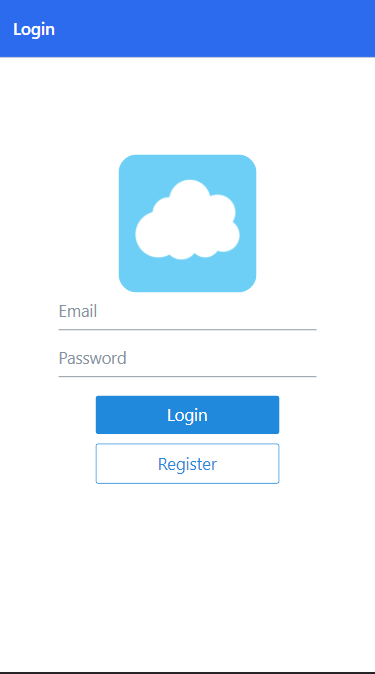

# 📱 — mobile-chat-app
Built Cross-platform mobile Chat application made with React native expo & firebase as database, login register authentication, react navigation

<!-- signal clone sonny sangha -->

<p>
</img>
</img>
</img>
</p>

<p>
</img>
</p>

## first create your react native app:
``` shell
expo init my-app
```
## install npm or yarn (up to you)
``` shell
npm install
```
## install react-navigation to make a navigation (fyi: this thing using stack)
``` shell
npm install @react-navigation/native@^5.x
expo install react-native-gesture-handler react-native-reanimated react-native-screens react-native-safe-area-context @react-native-community/masked-view
```
## install react native elements & vector-icons
``` shell
yarn add react-native-elements
yarn add react-native-vector-icons
npx react-native link react-native-vector-icons
```
``` shell
expo install firebase
```
